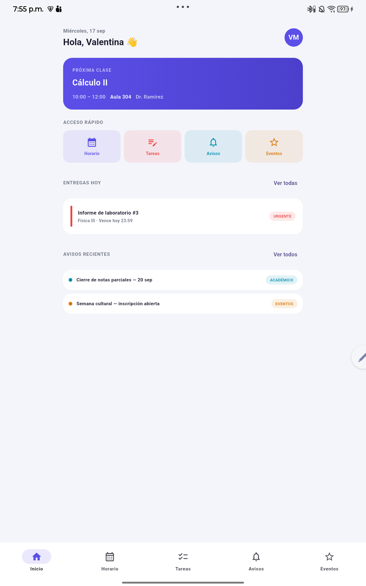

# Campus Connect

Aplicación Flutter creada a partir del diseño **Wireframe y mockup Campus Connect**. Reúne la información académica de una estudiante en seis pantallas: acceso, inicio, horario, tareas, avisos y eventos. Las tarjetas de tareas, avisos y eventos también abren una pantalla de detalle.

El proyecto es un **frontend de demostración**. Usa datos ficticios definidos en el código. El acceso no comprueba credenciales, las tareas marcadas y las inscripciones se conservan solo mientras la app está abierta, y no hay conexión con una base de datos.

## Ejecutar en Android

Abre `C:\Dev\Quiz_Movil` en Visual Studio Code y conecta un teléfono o tablet con depuración USB activada. En la terminal del proyecto:

```powershell
flutter pub get
flutter devices
flutter run -d ID_DEL_DISPOSITIVO
```

Sustituye `ID_DEL_DISPOSITIVO` por el identificador mostrado por `flutter devices`. Si solo hay un dispositivo, puedes ejecutar `flutter run`.

Para comprobar el código:

```powershell
flutter analyze
flutter test
```

## Estructura del código

| Archivo | Responsabilidad |
| --- | --- |
| `lib/main.dart` | Punto de entrada, configuración de la app, barra de navegación y estado compartido de tareas e inscripciones. |
| `lib/screens.dart` | Diseño e interacción de las pantallas. También contiene componentes de estructura como `ScreenFrame` y `SectionHeading`. |
| `lib/data.dart` | Clases que representan los datos y listas ficticias de materias, tareas, avisos y eventos. |
| `lib/theme.dart` | Paleta del mockup, tema Material y componentes visuales reutilizables como `CampusCard` y `CampusBadge`. |
| `test/widget_test.dart` | Pruebas de entrada, navegación, tarea entregada, filtro de avisos e inscripción visual. |
| `TALLER_CAMPUS_CONNECT.md` | Análisis del caso y guía de evidencias del taller. |

Los archivos Dart tienen comentarios junto a las decisiones importantes. Esta sección explica el recorrido completo para poder presentarlo en clase.

## Cómo empieza la aplicación

En `lib/main.dart`, `main()` llama a `runApp(const CampusConnectApp())`. `CampusConnectApp` crea `MaterialApp`, aplica `campusTheme()` y abre `LoginScreen` como primera pantalla.

`LoginScreen`, en `lib/screens.dart`, reproduce el acceso del mockup. El código de estudiante y la contraseña son campos editables, pero el botón **Ingresar** solo abre `CampusShell`. Se usa `Navigator.pushReplacement` para sustituir el acceso: al entrar, el botón Atrás no vuelve al formulario. El control para mostrar u ocultar la contraseña cambia `obscurePassword` mediante `setState`; ese valor solo afecta lo que se ve en pantalla.

## Navegación entre pantallas

`CampusShell` contiene cinco destinos en la barra inferior: **Inicio**, **Horario**, **Tareas**, **Avisos** y **Eventos**. La variable `selected` guarda el índice actual. Al tocar una pestaña, `goTo(index)` llama a `setState` y Flutter muestra la página correspondiente.

Las páginas se colocan en un `IndexedStack`. Esto mantiene vivos los widgets de las otras pestañas. Por ejemplo, si seleccionas otro día en Horario y visitas Tareas, al regresar a Horario sigue seleccionado el mismo día. Los cuatro accesos rápidos de Inicio llaman a `onNavigate` para activar una pestaña sin duplicar la lógica de navegación.

La función `showCampusDetail` usa `Navigator.push` para abrir `DetailScreen` encima de la pantalla actual. El botón Atrás cierra el detalle y devuelve a la misma pestaña.

## Qué hace cada pantalla

### Acceso

Presenta el logo, dos campos y el botón de entrada. La pantalla es una simulación del diseño: no envía el contenido de los campos a ningún servicio. El enlace de recuperación explica mediante un mensaje que esa función todavía no existe.

### Inicio

Muestra el saludo, la próxima clase, los accesos rápidos, una tarea urgente y dos avisos recientes. Las tarjetas de tarea y aviso pueden abrir sus detalles. Los datos visibles provienen de las listas de `lib/data.dart`.

### Horario

Los botones superiores cambian `activeDay`. El ejemplo del mockup proporciona clases para el miércoles; para los otros días se muestra un mensaje de estado vacío. `setState` reconstruye la pantalla cuando se elige otro día. Cada clase muestra horas, materia, docente y aula.

### Tareas

`campusTasks` guarda las cuatro tareas ficticias. `completedTasks`, en `CampusShell`, es un `Set<int>` con los índices marcados como entregados. Pulsar el círculo de una tarea ejecuta `toggleTask`, que agrega o quita su índice. La vista **Pendientes** muestra las que no están en el conjunto; **Entregadas** muestra las que sí están. Pulsar el texto de la tarea abre su detalle. El conjunto no se guarda en el dispositivo.

### Avisos

Los chips cambian la variable local `filter`. La lista visible se obtiene con `where`: **Todos** muestra los cuatro avisos; una categoría muestra solo los avisos que coinciden. Pulsar una tarjeta abre el texto completo. Los avisos son ficticios y su estado de lectura es el valor definido en `lib/data.dart`.

### Eventos

Cada tarjeta muestra fecha, lugar, categoría y cupos de ejemplo. `joinedEvents`, en `CampusShell`, guarda los índices de los eventos marcados. **Unirse** cambia visualmente a **Inscrito** mediante `toggleEvent`; volver a pulsarlo revierte el estado. Esta acción no reserva un cupo real. Pulsar el contenido de la tarjeta abre el detalle del evento.

## Datos y diseño reutilizables

`lib/data.dart` define cuatro modelos: `CampusClass`, `CampusTask`, `CampusNotice` y `CampusEvent`. Cada modelo reúne los campos que una pantalla necesita. Las listas `campusClasses`, `campusTasks`, `campusNotices` y `campusEvents` son constantes porque el contenido de demostración no se edita.

`lib/theme.dart` concentra los colores del mockup: fondo `#F4F5FA`, texto `#1A1A2E` y morado principal `#5B4FE8`. `CampusCard` da a las tarjetas el mismo fondo y borde redondeado; `CampusBadge` da un formato uniforme a categorías y fechas. `ScreenFrame` limita el ancho del contenido a 560 píxeles lógicos para que las páginas sean legibles tanto en teléfono como en tablet.

## Adaptación del mockup web

El ZIP presenta las pantallas dentro de marcos de teléfono hechos con React. Flutter usa la pantalla real del dispositivo, por lo que no dibuja ese marco. Se conservaron la paleta, la jerarquía visual, las tarjetas y los controles principales. Las fuentes **Plus Jakarta Sans** e **Inter** no venían como archivos en el ZIP; la app usa la fuente predeterminada de Flutter.

Algunos controles del prototipo solo cambiaban de apariencia o mostraban datos repetidos. En esta versión el filtro de avisos filtra la lista, las tareas marcadas pasan a **Entregadas**, los eventos cambian a **Inscrito** y los días sin clases tienen un mensaje claro.

## Pruebas realizadas

- `flutter analyze`: sin problemas.
- `flutter test`: pasan las pruebas de navegación, tareas, avisos y eventos.
- `flutter run -d HA1ZRSGA --no-resident`: compiló, instaló y abrió la aplicación en la tablet Android `TB330FU`.

Estas pruebas comprueban el frontend implementado. Para el taller todavía conviene recorrer manualmente todas las pantallas y guardar capturas de la ejecución en el dispositivo.

## Capturas de la app en tablet

Las siete capturas reales de la tablet Android están en [evidencias](evidencias/README.md): acceso, inicio, horario, tareas, avisos, eventos y detalle. Abre una imagen desde esa carpeta para verla o descargarla.


